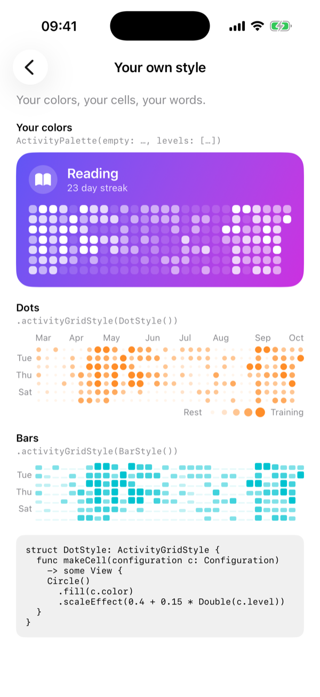
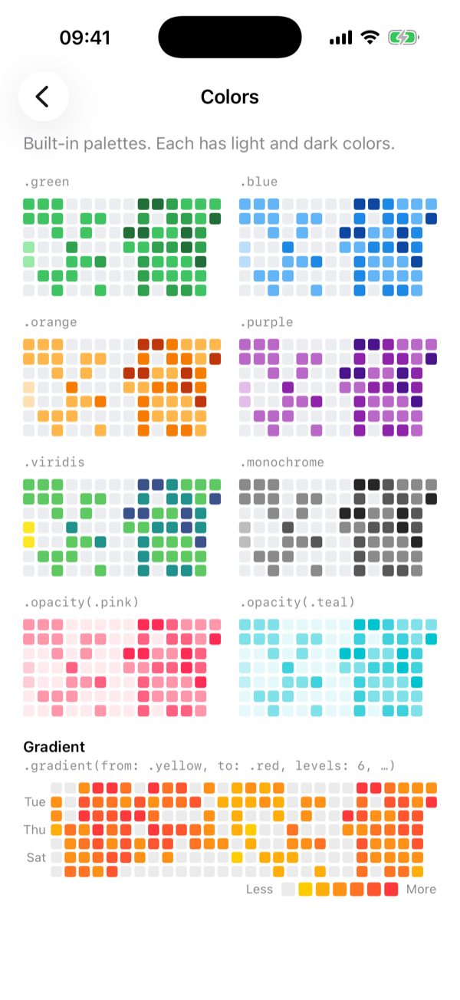
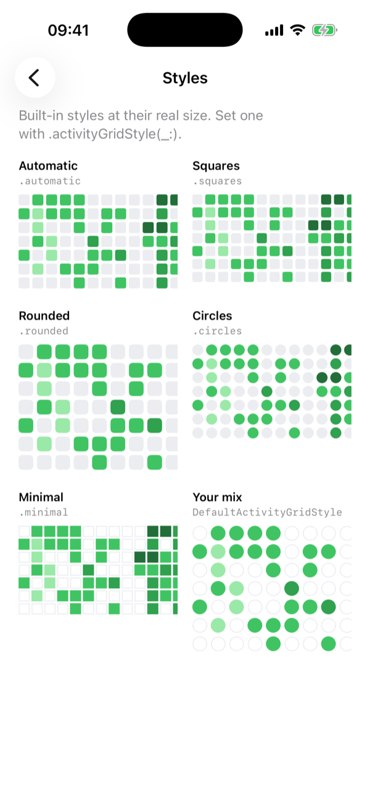
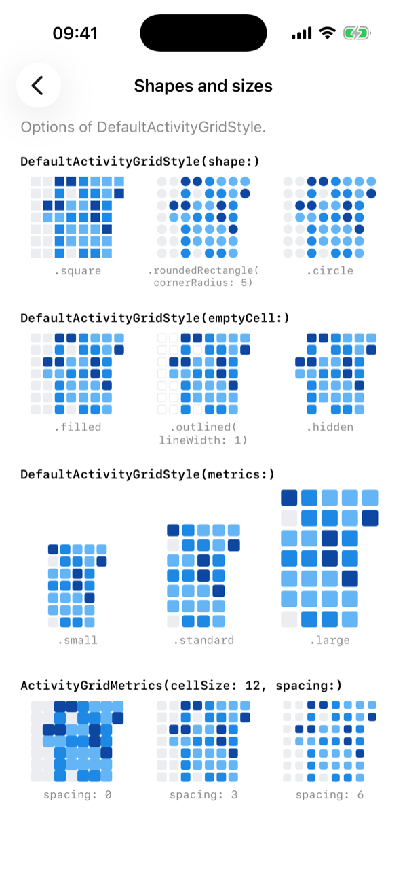
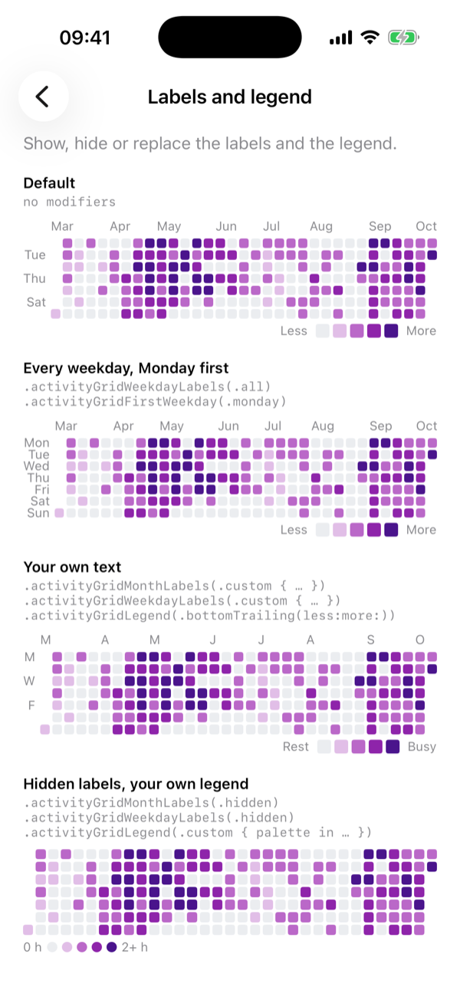
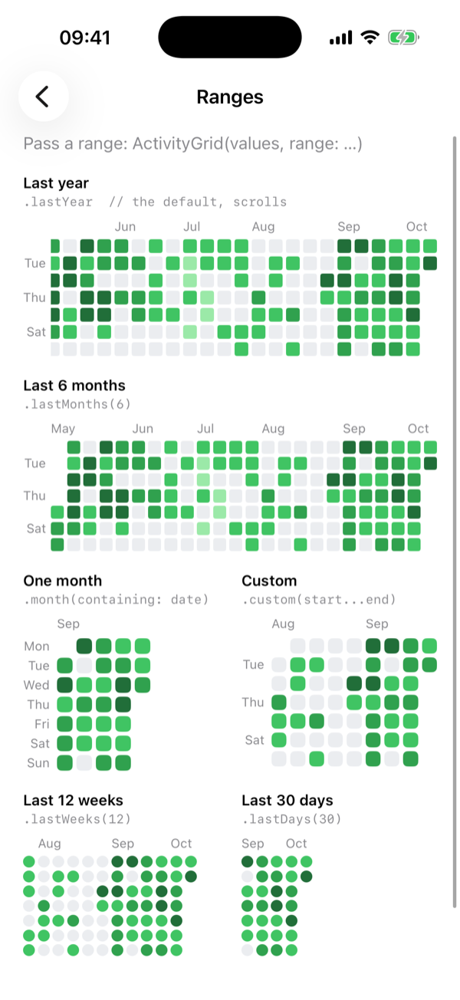
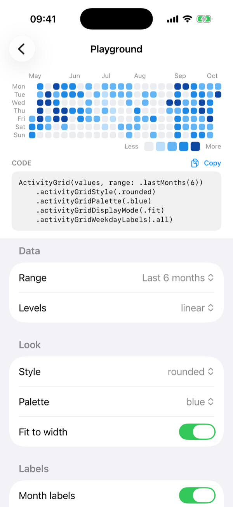

# SwiftUIActivityGrid


[](LICENSE)

A heatmap for SwiftUI. Show a year of daily activity at a glance: workouts, habits, journal entries, anything you count per day.

Make it look like your app. Pick the colors, the cell shape and size, or draw your own cells.

<p align="center">
  
  
  
</p>

## Features

- One view: `ActivityGrid`. Pass a `[Date: Double]` or your own types.
- Show the last year, months, weeks or days, a year, a month, or your own dates.
- Change colors, cell shape, size and spacing.
- Show, hide or change month labels, weekday labels and the legend.
- Draw your own cells with `ActivityGridStyle`.
- Tap a day to select it and see a tooltip.
- Scroll, or fit all weeks to the width.
- Export a card as PNG image to share on social media.
- No dependencies. No network. Nothing is stored.

## Customizable

The grid adapts to your app's design. It looks like part of your app.

- Colors: built-in palettes, one color in different opacities, a gradient, or your own colors.
- Shapes: squares, rounded squares, circles, or any SwiftUI shape.
- Sizes: cell size and spacing.
- Layout: scroll, or fit the width.
- Labels: your own month labels, weekday labels and legend.
- Cells: your own `ActivityGridStyle`, like a `ButtonStyle`.

Set options on one grid, or once on a container for all grids inside it.

<p align="center">
  
  
  
</p>

## Requirements

iOS 16, macOS 13, visionOS 1 or watchOS 9. Swift 6.

## Installation

In Xcode, choose **File → Add Package Dependencies…** and paste this URL:

```
https://github.com/ferenozcelik/swiftui-activity-grid
```

Then `import SwiftUIActivityGrid`.

## Quick start

```swift
import SwiftUI
import SwiftUIActivityGrid

struct ProfileView: View {
    let minutesByDay: [Date: Double]
    @State private var selectedDay: Date?

    var body: some View {
        ActivityGrid(minutesByDay, selection: $selectedDay)
    }
}
```

- Pass a `[Date: Double]`, or a collection of your own type that conforms to `ActivityEntry`.
- Values on the same day are added up.
- By default it shows the last year and scrolls to today.

## Options

Set options with modifiers. Put them on one grid, or on a container.

| Modifier | Default | What it does |
| --- | --- | --- |
| `range:` (initializer) | `.lastYear` | Days to show. `.lastDays(n)`, `.lastWeeks(n)`, `.lastMonths(n)`, `.year(2025)`, `.month(containing:)`, `.custom(start...end)` |
| `.activityGridStyle(_:)` | `.automatic` | Cell look. `.squares`, `.rounded`, `.circles`, `.minimal`, `DefaultActivityGridStyle(...)`, or your own style |
| `.activityGridPalette(_:)` | `.green` | Colors. `.blue`, `.orange`, `.purple`, `.viridis`, `.monochrome`, `.opacity(color)`, `.gradient(from:to:levels:empty:)`, `ActivityPalette(empty:levels:)` |
| `.activityGridLevels(_:)` | `.linear` | Value to color level. `.linear(max:)`, `.quantile`, `.thresholds([1, 5, 10, 20])`, `.custom { value, context in ... }` |
| `.activityGridDisplayMode(_:)` | `.scrollable` | `.fit` shows all weeks and sizes the cells to the width |
| `.activityGridMonthLabels(_:)` | `.automatic` | `.hidden`, `.custom { month in Text(...) }` |
| `.activityGridWeekdayLabels(_:)` | `.alternate` | `.all`, `.hidden`, `.custom { weekday in Text(...) }` |
| `.activityGridLegend(_:)` | `.automatic` | `.hidden`, `.bottomTrailing(less:more:)`, `.custom { palette in ... }` |
| `.activityGridCalendar(_:)` | `Calendar.current` | Calendar for days and weeks. Time zone, first weekday, locale |
| `.activityGridFirstWeekday(_:)` | from the calendar | `.monday`, `.sunday`, ... |
| `.activityGridNow(_:)` | current date | Sets "today". For widgets, tests and previews |
| `.onActivityDayTap(_:)` | none | Runs when a day is tapped |
| `.activityGridTooltip(_:)` | `.automatic` | `.hidden`, `.custom { day in ... }` |
| `.activityGridValueFormatter(_:)` | "5 activities" | Text for a value, like "32 min" |

The number of colors in the palette is the number of levels.

## Examples

### Fit the width

All weeks visible. No scrolling. Good for cards and widgets.

```swift
ActivityGrid(values, range: .lastMonths(6))
    .activityGridStyle(.circles)
    .activityGridPalette(.blue)
    .activityGridDisplayMode(.fit)
```

### Your own colors

```swift
ActivityGrid(values)
    .activityGridPalette(.gradient(from: .yellow, to: .red, levels: 5, empty: .gray.opacity(0.15)))

ActivityGrid(values)
    .activityGridPalette(ActivityPalette(
        empty: .gray.opacity(0.15),
        levels: [.mint.opacity(0.4), .mint.opacity(0.7), .mint]
    ))
```

### Your own cell style

```swift
struct DotStyle: ActivityGridStyle {
    func makeCell(configuration c: Configuration) -> some View {
        Circle()
            .fill(c.color)
            .scaleEffect(0.4 + 0.15 * Double(c.level))
    }
}

ActivityGrid(values)
    .activityGridStyle(DotStyle())
```

### Share as an image

Add the button where you want it. Nothing is shown until you do.

```swift
ActivityGridShareButton("Share", fileName: "My year", format: .story) {
    ActivityGridShareCard(format: .story, title: Text("My year of running"), footer: Text("my-app.com")) {
        ActivityGrid(values)
    }
}
```

Formats: `.story` (1080×1920), `.square` (1080×1080), `.landscape` (1600×900), `.fitContent()` and `.custom(size:)`.
The image is made on the device. The card has no logo and no watermark.
To get the data yourself, use `ActivityGridExporter.pngData(_:format:)`.

### Data saved in UTC

Pass a UTC calendar. Then a value at 23:30 UTC stays on the right day.

```swift
var calendar = Calendar(identifier: .gregorian)
calendar.timeZone = .gmt

ActivityGrid(values)
    .activityGridCalendar(calendar)
```

## Playground

The example app has a Playground page. Change options with controls. The page shows the Swift code for them. Copy the code into your app.

<p align="center">
  
</p>

1. Open `SwiftUIActivityGrid.xcworkspace` in Xcode.
2. Run the `ActivityGridExample` scheme.
3. Open **Playground**.

The app also has pages for styles, colors, shapes and sizes, ranges, labels and legend, and your own style.

## Documentation

The DocC docs are in `Sources/SwiftUIActivityGrid/SwiftUIActivityGrid.docc`. In Xcode, choose **Product → Build Documentation**.

## Contributing

Issues and pull requests are welcome. See [CONTRIBUTING.md](CONTRIBUTING.md).

## License

MIT. See [LICENSE](LICENSE).
