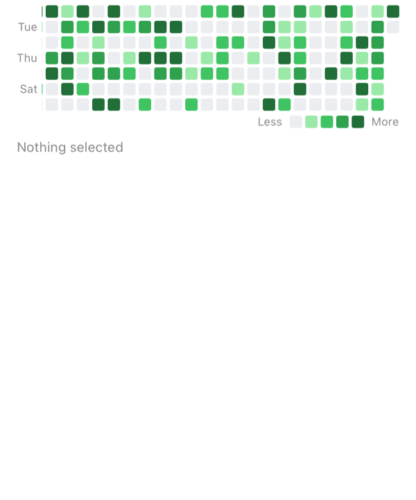
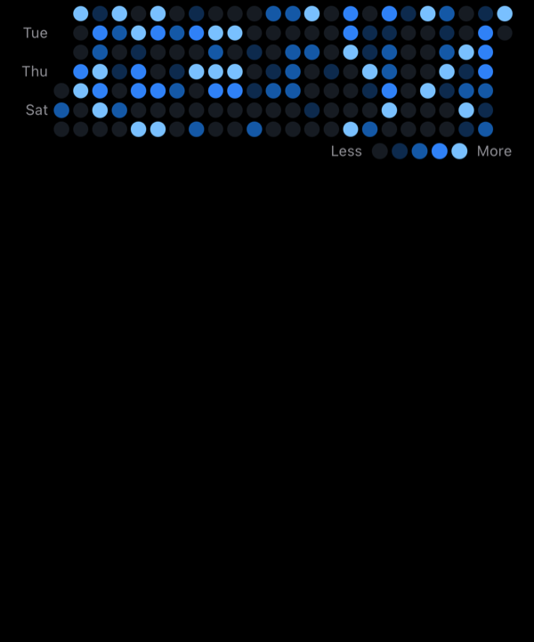
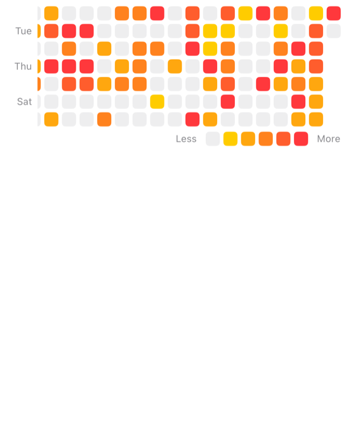
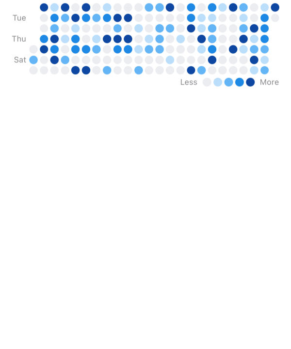
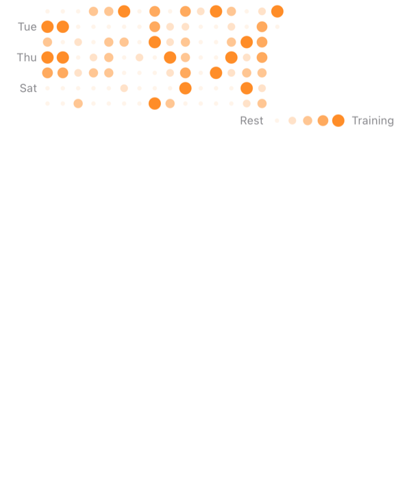
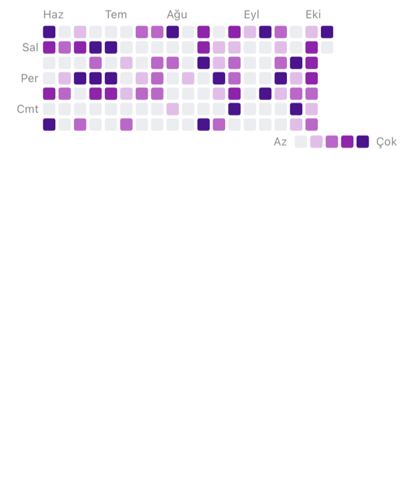

# SwiftUIActivityGrid - Heatmap and Contribution Graph for SwiftUI


[](LICENSE)
<!-- TODO: add the CI badge and the Swift Package Index badges once the repo is public and listed. -->

A heatmap of daily values for SwiftUI, like the contribution graph on a GitHub profile. Show workouts, habits, journal entries or anything else you count per day.

<p align="center">
  
  
  
</p>

## Why this one

- **Styled like `ButtonStyle`.** Write an `ActivityGridStyle` or tweak the built-in one, and set it once for the whole app with environment modifiers.
- **Gets the calendar right.** Days are grouped in your calendar and time zone, with DST days and your week start handled. All date maths goes through `Calendar`, so non-Gregorian calendars work too.
- **Streaks and totals built in.** `ActivityStatistics` works without the view, for example in a widget's timeline provider.
- **Works with VoiceOver.** Each day reads its date, value and level, and weeks are grouped so you can move week by week. The grid also reads a summary.
- **Every text can be replaced.** English and Turkish are built in. Labels follow the locale you pass in, not the device's, and you can supply your own text for every visible or spoken string.
- **Stores nothing.** No network, no storage, no dependencies. The privacy manifest is empty.

Requires iOS 16, macOS 13, visionOS 1 or watchOS 9.

## Installation

In Xcode, choose **File → Add Package Dependencies…** and paste:

```
https://github.com/ferenozcelik/swiftui-activity-grid
```

Or add it to `Package.swift`:

```swift
.package(url: "https://github.com/ferenozcelik/swiftui-activity-grid.git", from: "0.1.0")
```

The module is called `SwiftUIActivityGrid` and the view is `ActivityGrid`.

## Quick start

```swift
import SwiftUI
import SwiftUIActivityGrid

struct ProfileView: View {
    let minutesByDay: [Date: Double]
    @State private var selectedDay: Date?

    var body: some View {
        ActivityGrid(minutesByDay, selection: $selectedDay)
    }
}
```

- Pass a `[Date: Double]`, or any collection of your own type that conforms to `ActivityEntry`. Several values on one day are added up.
- The grid shows about the last year and scrolls to today. Tap a day to select it and see a tooltip.

## Options

Set options with modifiers, either on one grid or once on a container.

| Modifier | Default | Description |
| --- | --- | --- |
| `range:` (initializer) | `.lastYear` | `.lastDays(n)`, `.lastWeeks(n)`, `.lastMonths(n)`, `.year(2025)`, `.month(containing:)`, `.custom(start...end)` |
| `.activityGridStyle(_:)` | `.automatic` | `.github`, `.rounded`, `.circles`, `.minimal`, a `DefaultActivityGridStyle(...)`, or your own style |
| `.activityGridPalette(_:)` | `.green` | `.blue`, `.orange`, `.purple`, `.viridis` (colorblind-safe), `.monochrome`, `.opacity(color)`, `.gradient(from:to:levels:empty:)` |
| `.activityGridLevels(_:)` | `.linear` | `.linear(max:)`, `.quantile`, `.thresholds([1, 5, 10, 20])`, `.custom { value, context in ... }` |
| `.activityGridDisplayMode(_:)` | `.scrollable` | `.fit` shows every week and sizes the cells to the width |
| `.activityGridMonthLabels(_:)` | `.automatic` | `.hidden`, `.custom { month in Text(...) }` |
| `.activityGridWeekdayLabels(_:)` | `.alternate` | `.all`, `.hidden`, `.custom { weekday in Text(...) }` |
| `.activityGridLegend(_:)` | `.automatic` | `.hidden`, `.bottomTrailing(less:more:)`, `.custom { palette in ... }` |
| `.activityGridCalendar(_:)` | `Calendar.current` | Time zone, first weekday and locale for days and labels |
| `.activityGridFirstWeekday(_:)` | from the calendar | `.monday`, `.sunday`, … |
| `.activityGridNow(_:)` | the current date | Pins "today" for widgets, tests and previews |
| `.onActivityDayTap(_:)` | none | Runs after a day is tapped |
| `.activityGridTooltip(_:)` | `.automatic` | `.hidden`, `.custom { day in ... }` |
| `.activityGridValueFormatter(_:)` | "5 activities" | How values are written in the tooltip and read by VoiceOver |

The number of colors in the palette sets the number of levels, so the colors and the levels always match.

## Recipes

Each recipe is a card in the example app. Open `SwiftUIActivityGrid.xcworkspace`, run **ActivityGridExample**, and look at **Gallery** and **Playground**. The playground prints the code for whatever you set up.

<table>
<tr>
<td width="240"></td>
<td>

### Fit to the width

Every week visible, no scrolling. Good for cards and widgets.

```swift
ActivityGrid(values, range: .lastMonths(6))
    .activityGridStyle(.circles)
    .activityGridPalette(.blue)
    .activityGridDisplayMode(.fit)
```

</td>
</tr>
<tr>
<td width="240"></td>
<td>

### Your own colors

Blend any two colors. Colors that change with dark mode are blended for each mode.

```swift
ActivityGrid(values)
    .activityGridPalette(.gradient(from: .yellow, to: .red,
                                   levels: 5, empty: .gray.opacity(0.15)))
    .activityGridLevels(.quantile)
```

</td>
</tr>
<tr>
<td width="240"></td>
<td>

### Your own cell style

```swift
struct DotStyle: ActivityGridStyle {
    func makeCell(configuration: Configuration) -> some View {
        Circle()
            .fill(configuration.color)
            .scaleEffect(configuration.level == 0 ? 0.35 : 1)
    }
}

ActivityGrid(values)
    .activityGridStyle(DotStyle())
    .activityGridValueFormatter { "\(Int($0)) min" }
```

[`GalleryView.swift`](Example/ActivityGridExample/Gallery/GalleryView.swift)

</td>
</tr>
<tr>
<td width="240"></td>
<td>

### Your app's language and time zone

Labels and VoiceOver follow the locale of the calendar you pass in, or the SwiftUI `locale` environment value. Data recorded in UTC? Pass a UTC calendar so a workout at 23:30 UTC isn't shown on the next local day.

```swift
var calendar = Calendar(identifier: .gregorian)
calendar.timeZone = .gmt
calendar.locale = Locale(identifier: "tr_TR")

ActivityGrid(values)
    .activityGridCalendar(calendar)
```

</td>
</tr>
</table>

## Streaks and totals

```swift
let data = ActivityGridData(minutesByDay)
let stats = ActivityStatistics(data)

stats.currentStreak?.length   // today's streak, or yesterday's if today is still empty
stats.longestStreak?.length
stats.activeDays
stats.total
```

With years of data, build `ActivityGridData` once, keep it, and pass it to `ActivityGrid(data)` so it isn't rebuilt on every update.

## Languages

English and Turkish are built in. For any other language, the month and weekday names still come from the system, and the few remaining texts fall back to English. Replace them with `.activityGridLegend(.bottomTrailing(less:more:))`, `.activityGridValueFormatter`, `.activityGridTooltip`, `.activityGridAccessibilityLabel`, `.activityGridAccessibilityValue`, `.activityGridAccessibilityWeekLabel` and `.activityGridAccessibilitySummary`. Want your language in the package? See [CONTRIBUTING.md](CONTRIBUTING.md).

## Documentation

<!-- TODO: link the DocC documentation on Swift Package Index once the package is listed. -->
The DocC catalog lives in `Sources/SwiftUIActivityGrid/SwiftUIActivityGrid.docc`. In Xcode, choose **Product → Build Documentation**.

## Contributing

Issues and pull requests are welcome. See [CONTRIBUTING.md](CONTRIBUTING.md).

## License

MIT. See [LICENSE](LICENSE).
